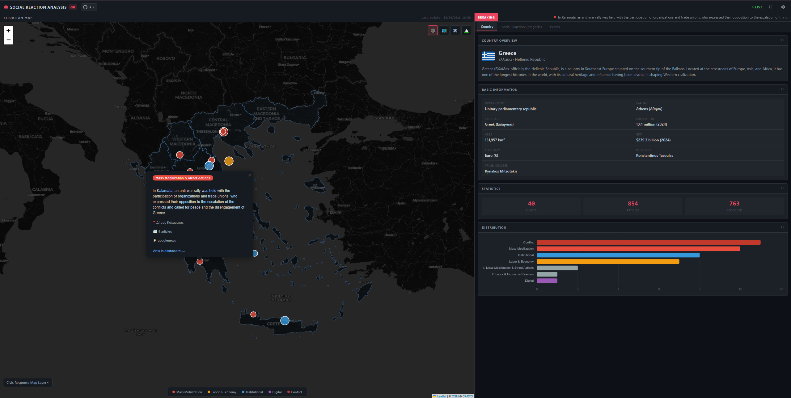
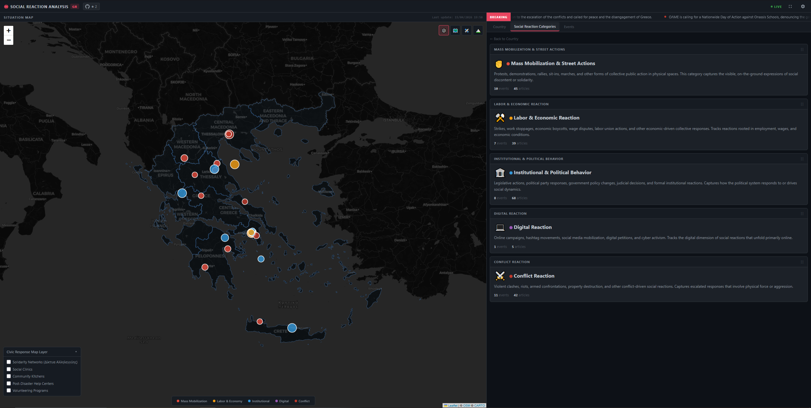
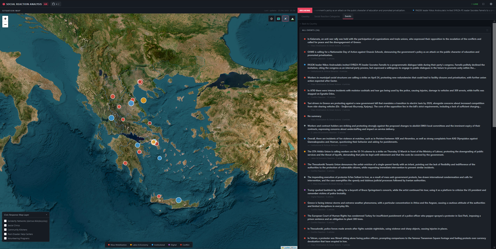

# Interactive System for Detection, Geospatial Visualization, and Semantic Analysis of Social Reactions in Greece

## Project Overview
This project involves the design and implementation of a platform that detects, analyzes, and geographically visualizes various forms of social reactions across Greece in real-time.

  

  

  

## Key Objectives
*   **Real-time Monitoring:** Tracking social movements and reactions as they happen.
*   **Data Mining:** Utilizing Web Crawlers for automated information extraction from multiple sources, including news websites.
*   **NLP (Natural Language Processing):** Applying Machine Learning techniques for:
    *   Processing written text.
    *   Detecting locations and dates.
    *   Clustering similar reactions.
    *   Extracting meaningful information.
*   **Visualization:** Creating an interactive map of Greece displaying categorized reactions, supported by Dashboards that present both quantitative and qualitative statistical data.

## Defined Categories of "Social Reaction"
The project focuses on five primary categories of social reactions:
1.  **Mass Mobilization & Street Actions:** Rallies, demonstrations, marches, blockades, and occupations.
2.  **Labor & Economic Reaction:** Strikes and boycotts.
3.  **Institutional & Political Behavior:** Election abstention and similar political stances.
4.  **Digital Reaction:** Use of hashtags, hacktivism, and whistleblowing.
5.  **Conflict Reaction:** Violent incidents and clashes.

## Project Roadmap & Implementation

The development is divided into five main phases:

### 1. Scope & Design
Definition of the specific "reactions" to be tracked, selection of data sources, and determination of the elements to be displayed on the dashboard.

### 2. Data Acquisition
Development of Web Crawlers and utilization of APIs to collect data on new reactions or updates on ongoing events.

### 3. NLP & Semantic Analysis
Implementation of NLP techniques to create text embeddings, management via a Vector Database, and clustering of similar social reactions.

### 4. LLM Processing
Leveraging Large Language Models (LLMs) for:
*   Information extraction.
*   Geospatial identification (Geocoding).
*   Summarization of reaction data.

### 5. Frontend Development
Building the user interface, featuring an interactive map of Greece and a comprehensive information dashboard.
